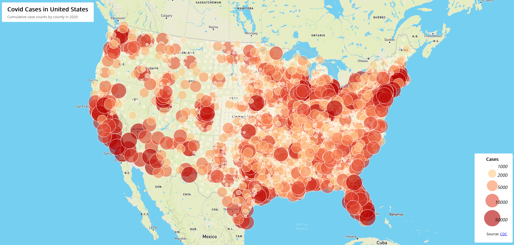
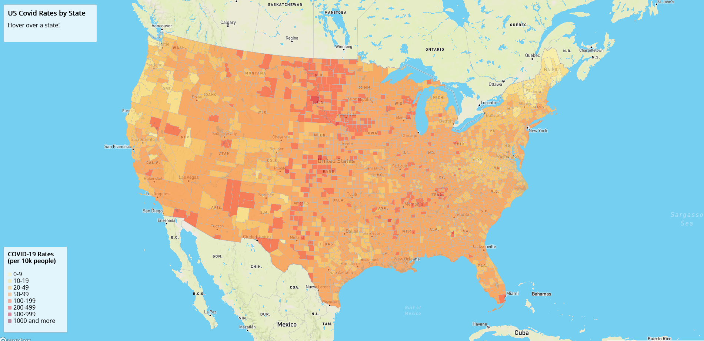

# COVID-19 Web Mapping Project

## Introduction
The goal of this project was to make two interactive web maps visualizing COVID-19 data in the United States during 2020.

## Map Description
- **[Map 1](map1.html)**: Proportional circles showing case counts by county
- **[Map 2](map2.html)**: Choropleth map showing infection rates per 10,000 people

## Screenshots

## Primary Functions

**Map 1:**
- Proportional symbol mapping with graduated circles
- Interactive popups on click to show counts of Covid cases
- Custom legend and title block
- Albers projection

**Map 2:**
- Choropleth visualization with 8-color classification
- Hover effects showing county name and rate
- Custom legend
- Albers projection

## Libraries
- Mapbox GL JS v2.8.1
- Google Fonts (Open Sans)

## Data Sources Used
- COVID-19 data: [CDC](https://www.cdc.gov/coronavirus/2019-ncov/cases-updates/cases-in-us.html)
- County boundaries: US Census Bureau

## Data Files
- **[us-covid-2020-counts(1).json](assets/us-covid-2020-counts(1).json)**: Used to construct the proportional symbol map
- **[us-covid-2020-rates(1).json](assets/us-covid-2020-rates(1).json)**: Used to construct the cloropleth map
